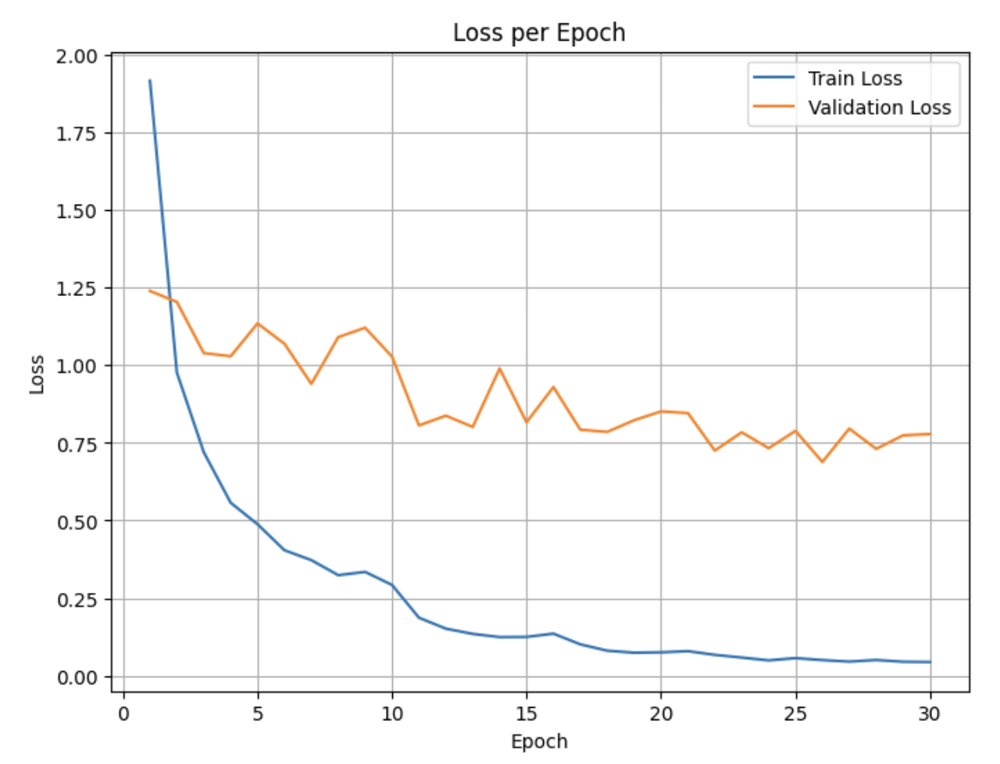
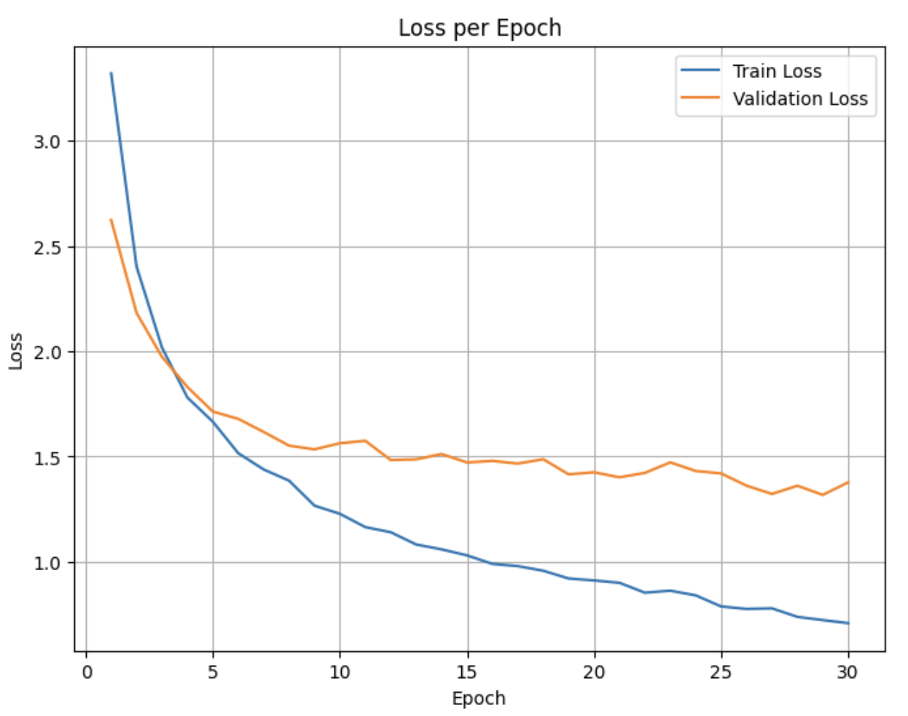
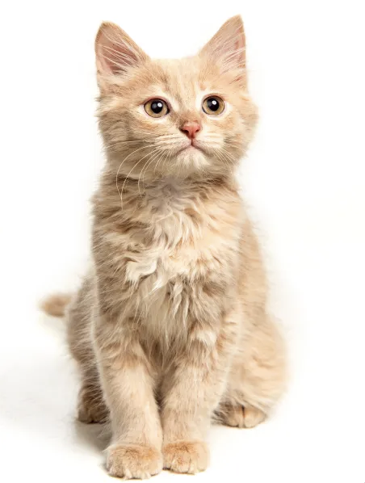
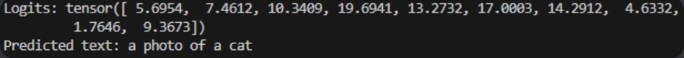
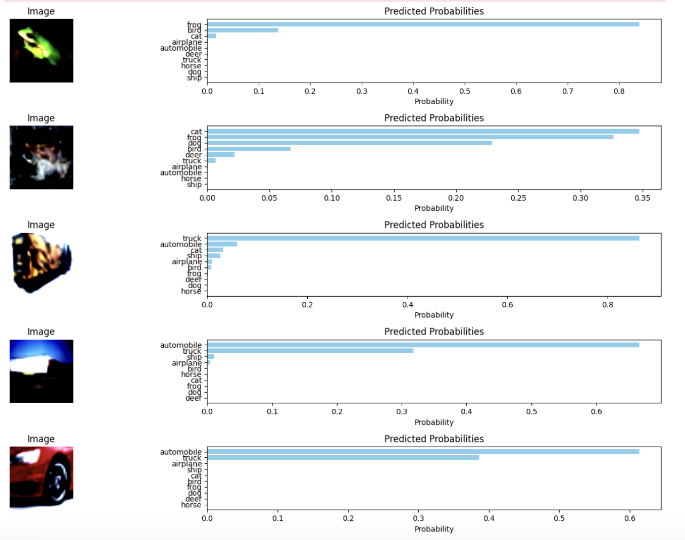
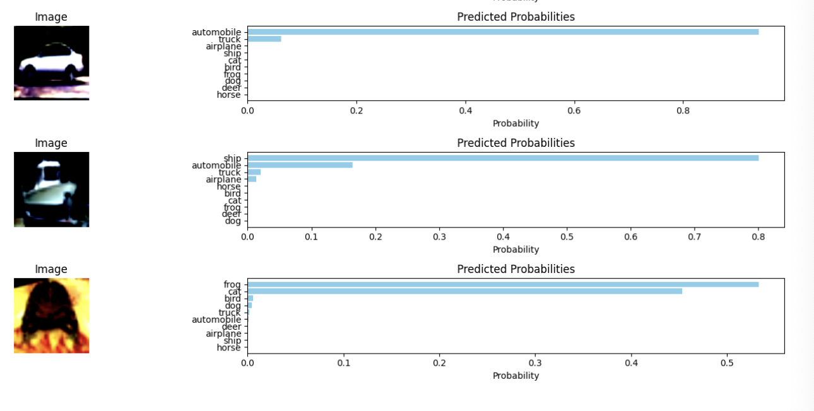

# **🦀CLIP Implementation Project**

This project aims to understand the working principles of **CLIP (Contrastive Language-Image Pre-training)** and implement it in a local environment to perform zero-shot classification experiments on a small-scale dataset. Pre-trained encoders (Image: ViT, Text: DistilBERT) are utilized to validate the image-text alignment effect, and various hyperparameter optimization and normalization techniques are applied.

---

# **🎾Table of Contents**

1. **Features**
2. **Branch Descriptions**
3. **Repository Structure**
4. **Key File Descriptions**
5. **Dataset and Preprocessing**
6. **Model Architecture, Training Parameters, and Experimental Results**
7. **Zero-shot Prediction Results**
8. **Additional Experiments and Future Improvements**
9. **References**

---

# 📌 Features

- **Dataset and Encoder Selection:**
    
    The model was trained using the small-scale Flickr8k dataset. To tackle the challenge of limited data, we leveraged pre-trained encoders (ViT for images and DistilBERT for text) to ensure stable training and robust generalization.
    
- **Fine-Tuning vs. Encoder Freezing:**
    
    We conducted a comparative analysis between fine-tuning the encoders and keeping them frozen, highlighting the performance differences in each approach.
    
- **Custom Dataset Construction:**
    
    A custom dataset was built based on the Flickr8k dataset, incorporating image preprocessing, random caption selection (from 5 captions per image), and tokenization.
    
- **Diverse Optimization Techniques:**
    
    To mitigate overfitting during training, we employed various optimization methods, including a ReduceLROnPlateau-based learning rate scheduler and early stopping.
    
- **Zero-Shot Classification and Prompt Engineering Analysis (CIFAR-10):**
    
    We performed zero-shot classification experiments on CIFAR-10 and analyzed performance variations using different text prompts such as "a photo of" and "a fuzzy photo of".
    
- **Reproducibility:**
    
    Reproducibility was ensured by fixing the random seeds across all libraries.
    

---

# **🌱 Branch Descriptions**

•	**main:** Contains all final results and key experimental outcomes.

•	**encoder_freeze:** Contains experimental results obtained with the image and text encoders frozen.

•	**Test_L*:** Branches recording intermediate experimental results.

---

# 📂 **Repository Structure**

📦 **CLIP_ImageText_Implementation**

┣ 📜 **README.md** # Project documentation and instructions

┣ 📜 **image_encoder.py**  # ViT-based image encoder with linear projection (768→256) and LayerNorm

┣ 📜 **text_encoder.py**   # DistilBERT-based text encoder extracting CLS token and performing linear projection(768→256) 

┣ 📜 **models.py** # Defines CLIP model combining image & text encoders, computes logits, and Cross-Entropy Loss

┣ 📜 **dataset.py** # Flickr8k dataset loader with preprocessing, caption handling, and tokenization

┣ 📜 **Train0313.ipynb** # Notebook containing model training loop, validation, experimental results, and loss graphs

┣ 📜 **CLIP_Zeroshot_Test.ipynb** # Notebook for zero-shot classification experiments using trained model

┣ 📜 **captions.txt** # Caption annotations for images

┣ 📜 **Flickr_8k.trainImages.txt** # Image filenames used for training

┣ 📜 **Flickr_8k.devImages.txt** # Image filenames used for validation

┣ 📜 **Flickr_8k.testImages.txt** # Image filenames used for testing

┗ 📂 **images/** # Folder containing the actual image files

---

# **📋 Key File Descriptions**

- **image_encoder.py**

**Role:** Loads a pre-trained ViT (Vision Transformer) to extract image features, then performs a linear projection from 768 to 256 dimensions and applies Layer Normalization.

- **text_encoder.py**
    
    **Role:** Performs text encoding based on the DistilBERT model.
    
    - It separates the MLP head to linearly transform the CLS token output and generate text embeddings.
- **models.py**
    
    **Role:** Defines the CLIPModel class.
    
    - Combines the image encoder (image_encoder) and text encoder (text_encoder) to compute logits through the inner product of the two embeddings.
    - includes a learnable temperature parameter and computes the final loss using a symmetric cross-entropy loss.
- **dataset.py**
    
    **Role:** Defines the Flickr8kDataset class.
    
    - Reads the captions.txt file and maps each image filename to multiple captions (each image has 5 provided captions). During data loading, one of the 5 captions is randomly selected for each image.
    - Generates a list of all image files and filters it to include only those images specified in the split files (Flickr_8k.trainImages.txt, Flickr_8k.devImages.txt, Flickr_8k.testImages.txt).
    - Applies the specified preprocessing (transform) to the image data and tokenizes the selected caption using the DistilBERT tokenizer.
    - Finally, returns a dictionary containing the image tensor and the tokenized text (input_ids, attention_mask).
- **train0313.ipynb**
    
    **Role:**
    
    - Composes the training, validation, and testing loops for the model.
    - Includes settings for random seed, DataLoader configuration, optimizer, and learning rate scheduler.
    - Identifies the optimal model via monitoring loss changes, early stopping, and model checkpoint saving, while also visualizing training/validation loss graphs to check for overfitting.
- **CLIP_Zeroshot_Test.ipynb**
    
    **Role:** Conducts zero-shot classification experiments using the trained model.
    
- **Additional Files**
    - captions.txt: Stores caption data for each image.
    - Flickr_8k.*Images.txt: Lists of image filenames for training, validation, and testing.
    - images/: Folder containing the actual image files.
    - Model_20250313_v1.pth: Checkpoint of the trained model.

---

# **📐Dataset and Preprocessing**

- **Dataset Selection and Caption Handling:**

Since the CLIP model is trained on sentence-level data, we selected the Flickr8k dataset which provides image-text pairs. The Flickr8k dataset offers 5 captions per image. In our dataset class, one of these 5 captions is randomly selected and mapped to its corresponding image. This strategy allows the model to learn various contextual cues for the same image by using a different caption at each epoch.

- **Image Preprocessing:**

Although we initially attempted to apply random cropping as suggested by the paper, we observed a performance drop when it was applied. Therefore, we opted for simple image resizing to 224×224 without additional augmentations. The image normalization is performed using the mean and standard deviation values specified in the official OpenAI documentation.

- **Token Length Analysis and max_length Setting:**

In the text preprocessing stage, captions are tokenized using the DistilBERT tokenizer. We analyzed the caption data to statistically determine the number of tokens per caption. The analysis showed that the average token length is about 32 tokens, and the 90th percentile is approximately 38 tokens. Based on these findings, we set the max_length to 40 to ensure that most captions are fully captured.

- **Relevant Code**
    
    ```jsx
    from transformers import DistilBertTokenizer
    import numpy as np
    
    tokenizer = DistilBertTokenizer.from_pretrained('distilbert-base-uncased')
    
    with open("captions.txt", "r", encoding="utf-8") as f:
        captions = [line.strip() for line in f if line.strip()]
    
    token_lengths = [len(tokenizer.encode(caption, truncation=True)) for caption in captions]
    
    print("최소 토큰 길이:", np.min(token_lengths))
    print("최대 토큰 길이:", np.max(token_lengths))
    print("평균 토큰 길이:", np.mean(token_lengths))
    print("중앙값 토큰 길이:", np.median(token_lengths))
    print("90% 분위수:", np.percentile(token_lengths, 90))
    
    ```
    
    - **Output:**
        
        Minimum token length: 6
        
        Maximum token length: 62
        
        Average token length: 32.16
        
        Median token length: 32.0
        
        90th percentile: 38.0
        

## 

---

# **📈Model Architecture, Training Parameters, and Experimental Results**

## **Model Architecture and Training Parameters**

   Pre-trained Encoders Used:

- Image Encoder: ViT
- Text Encoder: DistilBERT

We utilized the small-scale Flickr8k dataset for training, and to address the challenges of limited data, we incorporated pre-trained encoders. This approach ensured stable training and robust generalization.

## **Key Trainable Parameters:**

- Linear Projection Layer
- Learnable Temperature Parameter
- (For fine-tuning) The entire set of parameters of the image and text encoders

## **Training Setup**

**Environment:**

The model was trained on a T4 GPU on Google Colab. Fine-tuning required approximately 118 minutes, whereas using encoder freezing took around 48 minutes.

**Early Stopping:**

Training was terminated early if the validation loss did not improve for 5 consecutive epochs.

**Number of Epochs:**

Training was carried out for up to 30 epochs, with early stopping observed at around epoch 10 in some experiments.

**Learning Rate and Scheduler:**

- The initial learning rate was set to 1e4; however, early stopping occurred at 10 epochs.
- Changing the learning rate to 1e3 resulted in lower performance.
- Ultimately, an initial learning rate of 1e4 combined with a ReduceLROnPlateau scheduler (which reduces the learning rate by a factor of 0.5 after 2 consecutive epochs with no improvement) yielded the best performance.

## **Experimental Results**


<table align="center">
  <tr>
    <td align="center">
      <br>
      Fine-tuned
    </td>
    <td align="center">
      <br>
      Frozen
    </td>
  </tr>
</table>


| **Fine-Tuning Applied** | **Train Loss** | **Val Loss** | **Val Top-1** | **Val Top-5** | **Test Loss** | **Test Top-1 Accuracy** | **Test Top-5 Accuracy** |
| --- | --- | --- | --- | --- | --- | --- | --- |
| Applied | 0.0440 | 0.7786 | 79.60% | 97.80% | 0.7118 | 80.40% | 97.90% |
| Not Applied | 0.7076 | 1.3773 | 58.80% | 91.70% | 1.3710 | 57.20% | 93.10% |

Our experiments demonstrate that our fine-tuned model achieved a Top-1 accuracy of 80.4%, outperforming the frozen encoder baseline. When fine-tuning is applied, the model achieves a lower loss and higher accuracy compared to freezing the encoders.

However, overfitting is observed in both cases: while the training loss continues to decrease steadily, the validation loss declines more gradually. This indicates that the model struggles to generalize fully in a data-constrained environment.

---

# ⭐️Zero-shot Prediction Result

## **Zero-shot Prediction Overview:**

Zero-shot prediction evaluates how well a model can generalize to labels it has never been trained on. Without any additional MLP heads or extra label-image examples, the model uses its pre-trained image and text encoders to directly predict new classes.





The example above shows a cat image, with the model using the text prompt “a photo of a cat.” Models like CLIP, which jointly learn images and text, can infer new classes without further training. This indicates that the rich interaction between image and text embeddings grants the model a certain level of generalization capability, even for labels it has not explicitly learned.

## **Experimental Setup and Results**

We performed zero-shot classification experiments on the CIFAR-10 dataset by applying the prompt "a photo of" for each of the 10 class labels.




## **Results:**

- Top-1 Accuracy: **54%**, Top-3 Accuracy: **86%**
    - Since the model was trained on the high-quality, sentence-level captions of the Flickr8k dataset, its performance on the lower-resolution CIFAR-10 images is lower due to the domain gap.
    - Nonetheless, considering that these are zero-shot results (i.e., without any additional training on CIFAR-10), achieving a Top-1 accuracy of 54% is a meaningful performance.

## **Text Prompt Experiment**

- **Comparison Based on the Presence of a Prompt:**
    - Taking into account the low resolution (24×24) of CIFAR-10 images, we experimented by adding the phrase "a fuzzy photo of" to the prompt.
    - The following results compare the Top-1 and Top-3 accuracies with different prompt settings:
        - **Without any prompt:** Top-1: 51.21%, Top-3: 86%
        - **Using “a photo of”:** Top-1: 54.05%, Top-3: 86%
        - **Using “a fuzzy photo of”:** Top-1: 55.23%, Top-3: 86%
- **Interpretation:**
    - The addition of the prompt "a photo of" improved the Top-1 accuracy compared to having no prompt.
    - Moreover, by incorporating the term "a fuzzy photo of"—which better reflects the low-resolution nature of CIFAR-10 images—the performance was further improved.
    - This demonstrates that prompt engineering plays a significant role in zero-shot classification.
    

For further details and comparisons, please refer to the CLIP_Zeroshot_Test.ipynb notebook in the Test_L3 branch.

---

# **🎮Additional Experiments and Future Improvements**

- **MLP Head Performance Comparison:**
    
    Investigate the performance difference between adding an MLP head to the image encoder versus using the zero-shot approach (i.e., using only the pre-trained encoders without additional training) across various image classification tasks and datasets.
    
- **Exploring Alternative Image Encoders:**
    
    Evaluate the impact of different image encoders by replacing the current ViT-based encoder with alternatives such as ResNet, to assess how the choice of encoder affects overall performance.
    
- **Fine-Tuning vs. Training from Scratch:**
    
    Compare the performance differences between fine-tuning the pre-trained encoders and training the model from scratch without using any pre-trained weights.
    
- **Prompt Engineering and Hyperparameter Optimization:**
    
    Conduct further experiments to improve zero-shot classification performance by refining text prompts, as well as optimizing hyperparameters such as learning rate, batch size, and normalization techniques.
    
- **Evaluation on Diverse Datasets:**
    
    Beyond CIFAR-10, test the model on additional image classification datasets (e.g., CIFAR-100, SVHN) to assess the generalization and robustness of the model.
    

---

# 🔗References

Learning Transferable Visual Models From Natural Language Supervision https://arxiv.org/abs/2103.00020

GitHub - CLIP
https://github.com/openai/CLIP

ReduceLROnPlateau
https://pytorch.org/docs/stable/generated/torch.optim.lr_scheduler.ReduceLROnPlateau.html

vision_transformer
https://github.com/google-research/vision_transformer

Building CLIP From Scratch- University of Colorado Correll lab
https://medium.com/correll-lab/building-clip-from-scratch-68f6e42d35f4

BERT-pytorch
https://github.com/codertimo/BERT-pytorch

Image caption by transfer learning — Flickr8k data
https://medium.com/@heron20012003/image-caption-by-transfer-learning-flickr8k-data-51b54d3e6e02

How to train a new language model from scratch using Transformers and Tokenizers
https://huggingface.co/blog/how-to-train

Prompt_Engineering_for_ImageNet
https://github.com/openai/CLIP/blob/main/notebooks/Prompt_Engineering_for_ImageNet.ipynb

Google AI 2018 BERT pytorch implementation
https://github.com/codertimo/BERT-pytorch
